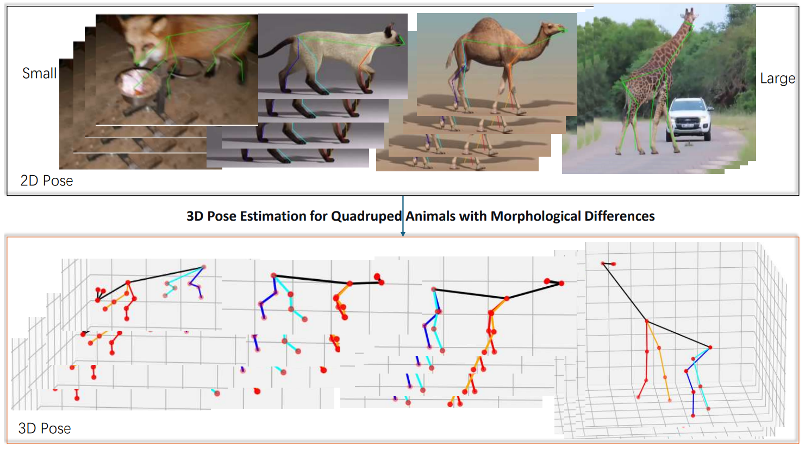

# 2D-to-3D Lifting for Quadruped Animals from Monocular Videos

A deep learning framework for 2D-to-3D pose lifting from monocular animal videos, enabling cross-species 3D skeleton reconstruction.

This project also provides the synthetic dataset **ZooPose-20**, covering 20 quadruped species with precise 3D ground truth and multi-view projections.

<p align="center">
  
</p>

## Quick Start

### Environment

The development and testing environment is as follows:

```bash
python 3.8 
PyTorch 1.13.1
CUDA 11.6
```

### Data Preparation

Download the ZooPose-20 dataset (in preparation, link forthcoming).

Or extract additional data following the approach of [AniMo](https://github.com/WandererXX/AniMo):

1. (Optional) Select species:
   ```bash
   python 00_select_animals.py
   ```

2. Extract keypoints:
   ```bash
   python 01_extract_animals_keypoints.py
   ```

3. Generate training data:
   ```bash
   python 02_prepare_data_animals.py
   ```

### Training

```bash
# Train QuadVideo3D
python 03_train.py --exp_name cross_attn_hyper_head --use_hyper_head --use_morph_cross_attn
```

### Model Download

In preparation, link forthcoming.

### Evaluation

```bash
# Evaluate QuadVideo3D
python 05_evaluate.py --checkpoint checkpoints/model.pt